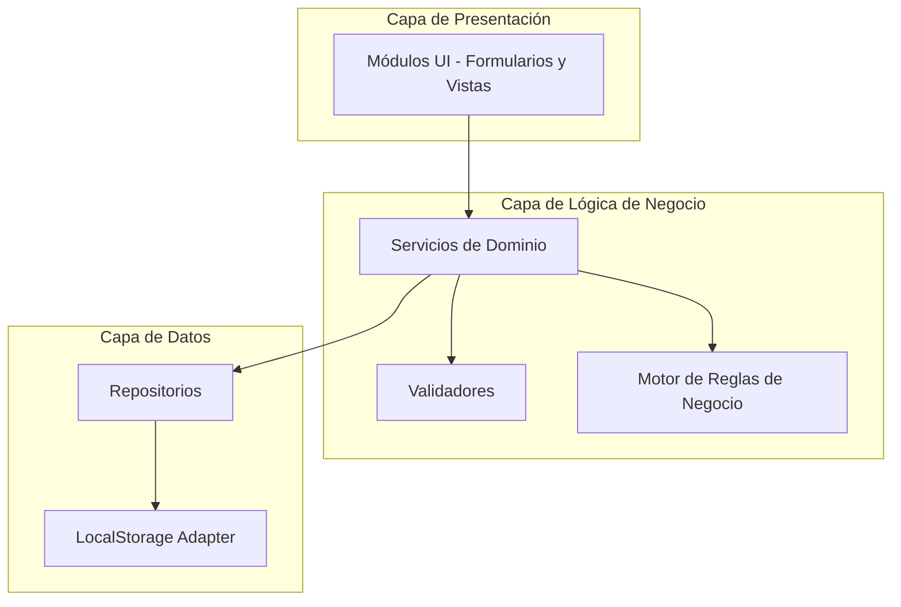
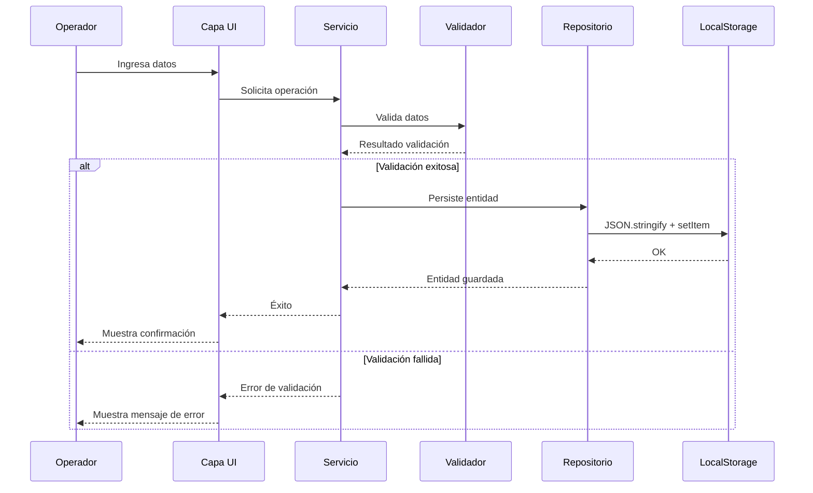
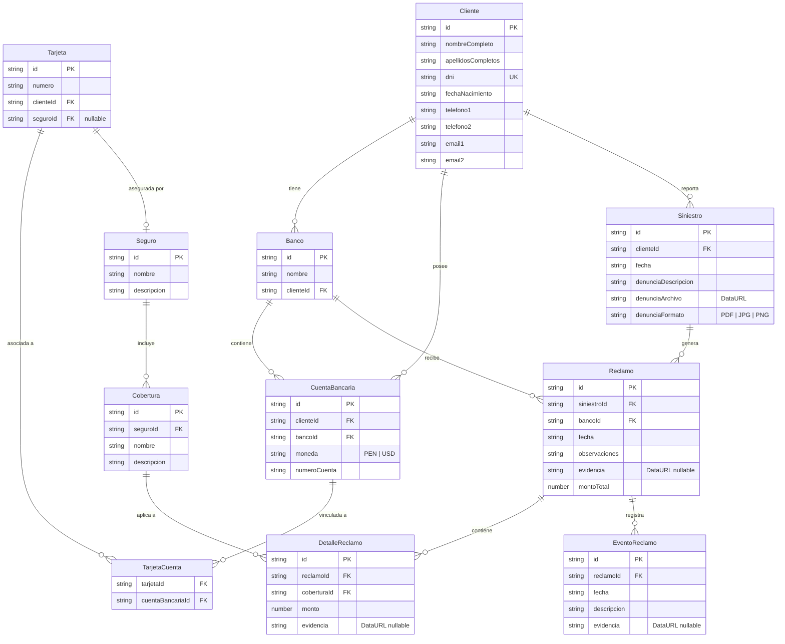

# Documento de Diseño - Sistema de Monitoreo de Reclamos

## Visión General

El Sistema de Monitoreo de Reclamos es una aplicación web de tipo SPA (Single Page Application) para una aseguradora que permite gestionar el ciclo completo de reclamos de seguros: desde el registro de clientes con sus cuentas bancarias y tarjetas aseguradas, hasta el seguimiento de eventos de cada reclamo. El sistema se construirá como una aplicación frontend con persistencia local, utilizando HTML, CSS y JavaScript vanilla, dado que el proyecto es greenfield y no cuenta con un backend definido.

### Decisiones de Diseño Clave

1. **SPA con JavaScript vanilla**: Sin frameworks pesados, manteniendo simplicidad y portabilidad.
2. **Persistencia con LocalStorage**: Los datos se almacenan en el navegador usando `localStorage` con serialización JSON, permitiendo operabilidad sin backend.
3. **Arquitectura modular por dominio**: Cada entidad del dominio (Cliente, Banco, Tarjeta, Seguro, Siniestro, Reclamo) tiene su propio módulo de lógica y UI.
4. **Validación en cliente**: Toda validación (DNI, formatos de archivo, reglas de negocio) se ejecuta en el frontend.
5. **Almacenamiento de archivos como Data URLs**: Las denuncias policiales y evidencias se almacenan como base64 Data URLs en localStorage.

## Arquitectura

La aplicación sigue una arquitectura de capas dentro del frontend:



### Flujo de Datos



## Componentes e Interfaces

### 1. Módulo de Validación (`validators.js`)

```javascript
// Valida DNI peruano con dígito verificador
validateDNI(dni: string): { valid: boolean, error?: string }

// Valida formato de archivo para denuncias policiales
validatePoliceReportFile(file: File): { valid: boolean, error?: string }

// Valida campos requeridos de una entidad
validateRequired(fields: Record<string, any>, requiredKeys: string[]): { valid: boolean, errors: string[] }

// Valida formato de email
validateEmail(email: string): { valid: boolean, error?: string }
```

### 2. Servicios de Dominio

#### `clientService.js`
```javascript
// Registra un nuevo cliente con validación de DNI y unicidad
registerClient(clientData): Client | ValidationError

// Busca cliente por DNI (coincidencia exacta)
findClientByDNI(dni: string): Client | null

// Busca clientes por nombre (coincidencia parcial, case-insensitive)
searchClientsByName(name: string): Client[]
```

#### `bankService.js`
```javascript
// Asocia un banco a un cliente
addBankToClient(clientId, bankData): Bank

// Registra una cuenta bancaria para un cliente en un banco
addBankAccount(clientId, bankId, currency: 'PEN' | 'USD'): BankAccount
```

#### `cardService.js`
```javascript
// Asocia una tarjeta a una o más cuentas bancarias del cliente
addCard(clientId, accountIds: string[]): Card

// Asigna un seguro a una tarjeta, aplicando regla de auto-aseguramiento por banco
assignInsurance(cardId, insuranceId): { card: Card, autoInsuredCards: Card[] }
```

#### `insuranceService.js`
```javascript
// Registra un seguro con sus coberturas
createInsurance(name, description, coverages: Coverage[]): Insurance

// Obtiene un seguro con todas sus coberturas
getInsuranceWithCoverages(insuranceId): Insurance
```

#### `incidentService.js`
```javascript
// Registra un siniestro con denuncia policial
createIncident(clientId, date, policeReport: { file: DataURL, description: string }): Incident
```

#### `claimService.js`
```javascript
// Registra un reclamo vinculado a un siniestro y banco
createClaim(incidentId, bankId, date, observations?, evidence?: DataURL): Claim

// Agrega un detalle de reclamo (cobertura + monto) y recalcula total
addClaimDetail(claimId, coverageId, amount, evidence?: DataURL): ClaimDetail

// Modifica un detalle de reclamo y recalcula total
updateClaimDetail(claimDetailId, coverageId, amount, evidence?: DataURL): ClaimDetail

// Calcula el monto total del reclamo
calculateClaimTotal(claimId): number

// Obtiene coberturas disponibles para un reclamo (según seguro del banco)
getAvailableCoverages(claimId): Coverage[]
```

#### `claimEventService.js`
```javascript
// Registra un evento de seguimiento en un reclamo
addClaimEvent(claimId, date, description, evidence?: DataURL): ClaimEvent

// Obtiene eventos de un reclamo ordenados cronológicamente
getClaimEvents(claimId): ClaimEvent[]
```

### 3. Repositorios (`repositories/`)

Cada repositorio encapsula el acceso a localStorage para una entidad:

```javascript
// Interfaz común de repositorio
interface Repository<T> {
    getAll(): T[]
    getById(id: string): T | null
    save(entity: T): T
    update(id: string, data: Partial<T>): T
    delete(id: string): void
    findBy(predicate: (item: T) => boolean): T[]
}
```

Repositorios: `ClientRepository`, `BankRepository`, `BankAccountRepository`, `CardRepository`, `InsuranceRepository`, `IncidentRepository`, `ClaimRepository`, `ClaimDetailRepository`, `ClaimEventRepository`.

### 4. Almacenamiento (`storage.js`)

```javascript
// Adaptador de localStorage con serialización JSON
getCollection(key: string): any[]
saveCollection(key: string, data: any[]): void
generateId(): string  // UUID v4 simple
```

### 5. Módulos UI (`ui/`)

Cada módulo UI gestiona la renderización y eventos de su sección:
- `clientUI.js` — Formulario de registro y búsqueda de clientes
- `bankUI.js` — Gestión de bancos y cuentas bancarias
- `cardUI.js` — Gestión de tarjetas y asignación de seguros
- `insuranceUI.js` — Gestión de seguros y coberturas
- `incidentUI.js` — Registro de siniestros con denuncia policial
- `claimUI.js` — Registro de reclamos y detalles
- `claimEventUI.js` — Registro y visualización de eventos

## Modelos de Datos

### Diagrama Entidad-Relación



### Estructuras de Datos (JSON en localStorage)

#### Cliente
```json
{
  "id": "uuid",
  "nombreCompleto": "string (requerido)",
  "apellidosCompletos": "string (requerido)",
  "dni": "string (9 dígitos, requerido, único)",
  "fechaNacimiento": "string ISO date (opcional)",
  "telefono1": "string (opcional)",
  "telefono2": "string (opcional)",
  "email1": "string (opcional)",
  "email2": "string (opcional)"
}
```

#### Banco
```json
{
  "id": "uuid",
  "nombre": "string (requerido)",
  "clienteId": "uuid FK"
}
```

#### CuentaBancaria
```json
{
  "id": "uuid",
  "clienteId": "uuid FK",
  "bancoId": "uuid FK",
  "moneda": "PEN | USD",
  "numeroCuenta": "string"
}
```

#### Tarjeta
```json
{
  "id": "uuid",
  "numero": "string",
  "clienteId": "uuid FK",
  "cuentaIds": ["uuid FK"],
  "seguroId": "uuid FK | null"
}
```

#### Seguro
```json
{
  "id": "uuid",
  "nombre": "string (requerido)",
  "descripcion": "string (requerido)"
}
```

#### Cobertura
```json
{
  "id": "uuid",
  "seguroId": "uuid FK",
  "nombre": "string (requerido)",
  "descripcion": "string"
}
```

#### Siniestro
```json
{
  "id": "uuid",
  "clienteId": "uuid FK",
  "fecha": "string ISO date",
  "denunciaDescripcion": "string (requerido)",
  "denunciaArchivo": "DataURL string",
  "denunciaFormato": "PDF | JPG | PNG"
}
```

#### Reclamo
```json
{
  "id": "uuid",
  "siniestroId": "uuid FK",
  "bancoId": "uuid FK",
  "fecha": "string ISO date",
  "observaciones": "string (opcional)",
  "evidencia": "DataURL string | null",
  "montoTotal": "number (calculado)"
}
```

#### DetalleReclamo
```json
{
  "id": "uuid",
  "reclamoId": "uuid FK",
  "coberturaId": "uuid FK",
  "monto": "number (requerido)",
  "evidencia": "DataURL string | null"
}
```

#### EventoReclamo
```json
{
  "id": "uuid",
  "reclamoId": "uuid FK",
  "fecha": "string ISO date",
  "descripcion": "string (requerido)",
  "evidencia": "DataURL string | null"
}
```

### Algoritmo de Validación del DNI (Dígito Verificador)

El DNI peruano consta de 8 dígitos numéricos más un noveno carácter verificador (puede ser dígito o letra). El algoritmo de validación:

1. Tomar los primeros 8 dígitos del DNI.
2. Multiplicar cada dígito por los factores `[3, 2, 7, 6, 5, 4, 3, 2]` respectivamente.
3. Sumar todos los productos.
4. Obtener el residuo de la división entre 11: `residuo = suma % 11`.
5. Calcular la diferencia: `diferencia = 11 - residuo`.
6. Mapear la diferencia al dígito verificador usando la tabla:
   - `{0: '6', 1: '7', 2: '8', 3: '9', 4: '0', 5: '1', 6: '1', 7: '2', 8: '3', 9: '4', 10: '5', 11: '6'}`
   - O alternativamente con letras: `{0: 'K', 1: 'A', 2: 'B', 3: 'C', 4: 'D', 5: 'E', 6: 'F', 7: 'G', 8: 'H', 9: 'I', 10: 'J', 11: 'K'}`
7. El noveno carácter debe coincidir con el dígito o letra resultante.

### Regla de Auto-Aseguramiento por Banco

Cuando se asigna un seguro a una tarjeta:

1. Identificar el banco de la tarjeta (a través de sus cuentas bancarias).
2. Buscar todas las demás tarjetas del mismo cliente que estén asociadas a cuentas del mismo banco.
3. Para cada tarjeta encontrada:
   - Si no tiene seguro: asignar el mismo seguro automáticamente.
   - Si tiene un seguro diferente: solicitar confirmación al operador antes de reemplazar.
4. Retornar la lista de tarjetas auto-aseguradas para notificación.

### Cálculo Automático del Monto Total del Reclamo

```
montoTotal = Σ (detalle.monto) para cada detalle en DetalleReclamo donde detalle.reclamoId == reclamo.id
```

El monto total se recalcula cada vez que se agrega, modifica o elimina un detalle de reclamo.

## Propiedades de Correctitud

*Una propiedad es una característica o comportamiento que debe mantenerse verdadero en todas las ejecuciones válidas de un sistema — esencialmente, una declaración formal sobre lo que el sistema debe hacer. Las propiedades sirven como puente entre especificaciones legibles por humanos y garantías de correctitud verificables por máquina.*

### Propiedad 1: Validación del DNI — round trip del dígito verificador

*Para cualquier* secuencia de 8 dígitos numéricos, calcular el dígito verificador y luego validar el DNI completo (8 dígitos + verificador) debe retornar válido. Inversamente, para cualquier DNI de 9 caracteres donde el noveno carácter NO coincida con el verificador calculado, la validación debe retornar inválido.

**Valida: Requisitos 1.4, 1.5**

### Propiedad 2: Campos requeridos del Cliente

*Para cualquier* objeto de datos de cliente, el registro debe ser exitoso si y solo si contiene nombre completo, apellidos completos y un DNI válido. Cualquier combinación de campos opcionales (fecha de nacimiento, teléfonos, correos) presentes o ausentes no debe afectar el resultado de la validación de campos requeridos.

**Valida: Requisitos 1.2, 1.3**

### Propiedad 3: Unicidad del DNI

*Para cualquier* par de clientes con el mismo DNI, el sistema debe rechazar el registro del segundo cliente. Después de registrar un cliente con un DNI dado, intentar registrar otro cliente con el mismo DNI debe fallar, y la cantidad total de clientes no debe incrementarse.

**Valida: Requisito 1.6**

### Propiedad 4: Persistencia round-trip del Cliente

*Para cualquier* cliente válido registrado en el sistema, recuperar ese cliente por su ID debe retornar un objeto con todos los campos idénticos a los datos originales de registro.

**Valida: Requisito 1.1**

### Propiedad 5: Moneda de cuenta bancaria restringida a PEN/USD

*Para cualquier* intento de registro de cuenta bancaria, el sistema debe aceptar únicamente los valores "PEN" o "USD" como moneda. Cualquier otro valor de moneda debe ser rechazado.

**Valida: Requisito 2.3**

### Propiedad 6: Multiplicidad de entidades asociadas

*Para cualquier* cliente, al asociar N bancos, M cuentas bancarias o K siniestros, la cantidad de entidades almacenadas para ese cliente debe ser exactamente N, M o K respectivamente. Agregar una entidad debe incrementar el conteo en exactamente 1.

**Valida: Requisitos 2.1, 2.2, 6.6, 8.6, 9.3, 10.5**

### Propiedad 7: Restricción de un seguro por tarjeta

*Para cualquier* tarjeta que ya tiene un seguro asignado, intentar asignar un segundo seguro diferente (sin pasar por el flujo de confirmación de reemplazo) debe ser rechazado, y el seguro original debe permanecer sin cambios.

**Valida: Requisito 3.4**

### Propiedad 8: Auto-aseguramiento por banco

*Para cualquier* cliente con N tarjetas vinculadas a cuentas de un mismo banco, al asignar un seguro a una de esas tarjetas, todas las N tarjetas de ese banco deben tener el mismo seguro asignado, y el sistema debe reportar exactamente (N-1) tarjetas adicionales aseguradas.

**Valida: Requisitos 4.1, 4.2**

### Propiedad 9: Detección de conflictos en auto-aseguramiento

*Para cualquier* tarjeta del mismo banco que ya posee un seguro diferente al que se está asignando, el sistema debe identificarla como conflicto y requerir confirmación antes de reemplazar. La lista de conflictos debe contener exactamente las tarjetas con seguros diferentes.

**Valida: Requisito 4.3**

### Propiedad 10: Seguro debe contener al menos una cobertura

*Para cualquier* intento de crear un seguro, el sistema debe requerir al menos una cobertura. Un seguro con lista vacía de coberturas debe ser rechazado.

**Valida: Requisito 5.2**

### Propiedad 11: Round-trip de seguro con coberturas

*Para cualquier* seguro creado con N coberturas, al consultar ese seguro, la lista de coberturas retornada debe contener exactamente las mismas N coberturas con todos sus datos intactos.

**Valida: Requisitos 5.1, 5.4**

### Propiedad 12: Validación de formato de denuncia policial

*Para cualquier* archivo adjunto a un siniestro, el sistema debe aceptarlo si y solo si su formato es PDF, JPG o PNG. Cualquier otro formato debe ser rechazado con un mensaje de error.

**Valida: Requisitos 6.3, 6.5**

### Propiedad 13: Campos requeridos del siniestro

*Para cualquier* intento de registro de siniestro, el sistema debe requerir un cliente existente, una fecha, un archivo de denuncia policial y una descripción. La ausencia de cualquiera de estos campos debe resultar en rechazo.

**Valida: Requisitos 6.1, 6.2, 6.3, 6.4**

### Propiedad 14: Búsqueda exacta por DNI

*Para cualquier* conjunto de clientes registrados y cualquier DNI de búsqueda, el resultado debe ser exactamente el cliente cuyo DNI coincide, o null si no existe. No debe retornar coincidencias parciales.

**Valida: Requisito 7.2**

### Propiedad 15: Búsqueda parcial por nombre

*Para cualquier* conjunto de clientes registrados y cualquier cadena de búsqueda, los resultados deben incluir todos y solo los clientes cuyo nombre completo o apellidos contengan la cadena de búsqueda (case-insensitive).

**Valida: Requisito 7.3**

### Propiedad 16: Validación de reclamo vinculado a banco del cliente

*Para cualquier* reclamo, el banco seleccionado debe estar vinculado al cliente del siniestro asociado. Intentar crear un reclamo con un banco no vinculado al cliente debe ser rechazado.

**Valida: Requisitos 8.1, 8.2, 8.3**

### Propiedad 17: Filtrado de coberturas por banco del reclamo

*Para cualquier* reclamo vinculado a un banco, las coberturas disponibles para los detalles del reclamo deben ser exactamente las coberturas del seguro asignado a las tarjetas de ese banco. No deben aparecer coberturas de otros seguros.

**Valida: Requisito 9.1**

### Propiedad 18: Cálculo automático del monto total del reclamo

*Para cualquier* reclamo con N detalles de reclamo, cada uno con un monto arbitrario, el monto total almacenado en el reclamo debe ser exactamente igual a la suma aritmética de todos los montos de los detalles. Esta propiedad debe mantenerse después de agregar, modificar o eliminar cualquier detalle.

**Valida: Requisitos 9.4, 9.5**

### Propiedad 19: Campos requeridos del detalle de reclamo

*Para cualquier* intento de registro de detalle de reclamo, el sistema debe requerir una cobertura y un monto. La ausencia de cualquiera debe resultar en rechazo.

**Valida: Requisito 9.2**

### Propiedad 20: Campos requeridos del evento de reclamo

*Para cualquier* intento de registro de evento de reclamo, el sistema debe requerir un reclamo existente, una fecha y una descripción. La ausencia de cualquiera debe resultar en rechazo.

**Valida: Requisitos 10.1, 10.2, 10.3**

### Propiedad 21: Ordenamiento cronológico de eventos

*Para cualquier* reclamo con N eventos con fechas arbitrarias, al consultar los eventos, estos deben estar ordenados de forma ascendente por fecha. Para todo par consecutivo de eventos (e_i, e_{i+1}), se debe cumplir que e_i.fecha <= e_{i+1}.fecha.

**Valida: Requisito 10.6**

### Propiedad 22: Asociación de tarjeta a cuentas del mismo cliente

*Para cualquier* tarjeta, todas las cuentas bancarias a las que está asociada deben pertenecer al mismo cliente. Intentar asociar una tarjeta a cuentas de diferentes clientes debe ser rechazado.

**Valida: Requisito 3.1**

## Manejo de Errores

### Categorías de Error

| Categoría | Descripción | Comportamiento |
|-----------|-------------|----------------|
| Validación de campos | Campos requeridos faltantes o formato inválido | Mostrar mensaje de error junto al campo, no persistir datos |
| Validación de DNI | DNI con formato incorrecto o dígito verificador inválido | Mostrar mensaje específico indicando el problema del DNI |
| Unicidad | DNI duplicado al registrar cliente | Mostrar mensaje indicando que el cliente ya existe |
| Formato de archivo | Denuncia policial en formato no permitido | Mostrar mensaje con los formatos permitidos (PDF, JPG, PNG) |
| Referencia inválida | Entidad referenciada no existe (cliente, siniestro, banco) | Mostrar mensaje indicando que la entidad no fue encontrada |
| Conflicto de seguro | Tarjeta ya tiene seguro asignado | Mostrar diálogo de confirmación para reemplazo |
| Banco no vinculado | Banco seleccionado no pertenece al cliente del siniestro | Mostrar mensaje indicando que el banco no está vinculado al cliente |
| Almacenamiento | Error de localStorage (cuota excedida, no disponible) | Mostrar mensaje genérico de error de almacenamiento |

### Estrategia de Manejo

1. **Validación temprana**: Validar todos los datos antes de intentar persistir. Los validadores retornan objetos `{ valid: boolean, errors: string[] }`.
2. **Mensajes descriptivos**: Cada error incluye un mensaje legible para el operador en español.
3. **Sin pérdida de datos**: En caso de error, los datos ingresados por el operador se mantienen en el formulario.
4. **Errores de almacenamiento**: Capturar excepciones de `localStorage` (QuotaExceededError) y mostrar mensaje apropiado.

### Formato de Error

```javascript
{
  field: "dni",           // Campo que generó el error
  code: "INVALID_DNI",   // Código de error para programación
  message: "El dígito verificador del DNI es incorrecto" // Mensaje para el usuario
}
```

## Estrategia de Testing

### Enfoque Dual de Testing

El sistema utiliza dos enfoques complementarios de testing:

1. **Tests unitarios**: Verifican ejemplos específicos, casos borde y condiciones de error.
2. **Tests basados en propiedades (PBT)**: Verifican propiedades universales con entradas generadas aleatoriamente.

### Librería de Testing

- **Framework de tests**: Jest (o Vitest para compatibilidad con ES modules)
- **Librería PBT**: `fast-check` — librería de property-based testing para JavaScript
- **Configuración PBT**: Mínimo 100 iteraciones por test de propiedad

### Tests Basados en Propiedades

Cada propiedad de correctitud definida en este documento debe implementarse como un único test basado en propiedades usando `fast-check`. Cada test debe:

- Ejecutar un mínimo de 100 iteraciones con entradas generadas aleatoriamente
- Referenciar la propiedad del documento de diseño mediante un comentario con el formato:
  `// Feature: claims-monitoring-system, Property {N}: {título de la propiedad}`
- Usar generadores (`fc.record`, `fc.string`, `fc.integer`, etc.) para crear datos de entrada válidos

#### Generadores Principales

- **DNI Generator**: Genera 8 dígitos aleatorios y calcula el dígito verificador correcto
- **Client Generator**: Genera datos de cliente con campos requeridos válidos y campos opcionales aleatorios
- **Currency Generator**: `fc.constantFrom('PEN', 'USD')`
- **Amount Generator**: `fc.float({ min: 0.01, max: 999999.99 })` con 2 decimales
- **File Format Generator**: `fc.constantFrom('PDF', 'JPG', 'PNG')` para formatos válidos
- **Date Generator**: `fc.date()` convertido a ISO string

### Tests Unitarios

Los tests unitarios cubren:

- **Ejemplos concretos**: Registro de un cliente con datos específicos conocidos
- **Casos borde**: Cliente sin bancos, tarjeta sin seguro, reclamo sin detalles, búsqueda sin resultados
- **Condiciones de error**: DNI duplicado, formato de archivo inválido, banco no vinculado
- **Integración entre componentes**: Flujo completo de siniestro → reclamo → detalle → evento

### Cobertura por Módulo

| Módulo | Tests Unitarios | Tests de Propiedad |
|--------|----------------|-------------------|
| Validación DNI | Ejemplos con DNIs conocidos | Propiedad 1 (round-trip verificador) |
| Registro Cliente | Registro exitoso, campos faltantes | Propiedades 2, 3, 4 |
| Cuentas Bancarias | Registro con PEN/USD | Propiedades 5, 6 |
| Tarjetas y Seguros | Asignación simple, conflicto | Propiedades 7, 8, 9, 10, 11, 22 |
| Siniestros | Registro con PDF, formato inválido | Propiedades 12, 13 |
| Búsqueda | Búsqueda por DNI exacto, por nombre parcial | Propiedades 14, 15 |
| Reclamos | Registro vinculado, coberturas filtradas | Propiedades 16, 17, 18, 19 |
| Eventos | Registro, orden cronológico | Propiedades 20, 21 |
